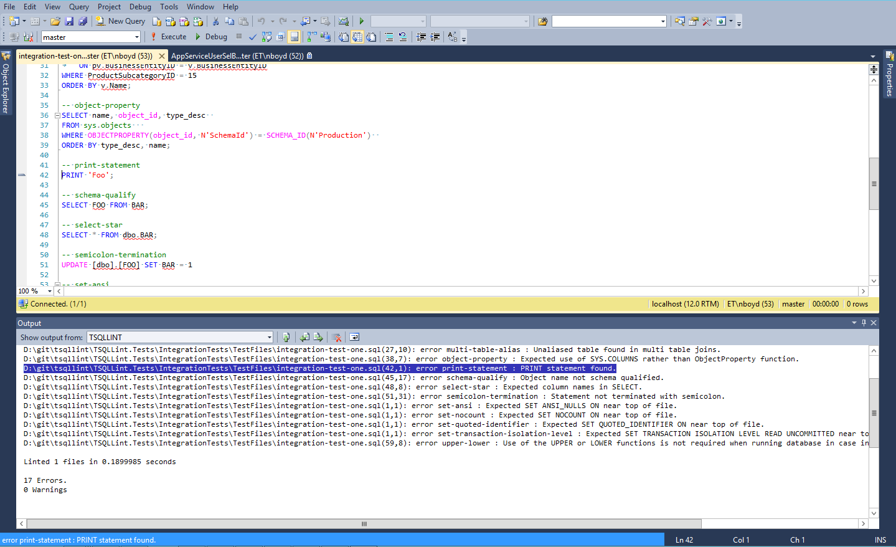

[](https://badge.fury.io/js/tsqllint)
[](https://ci.appveyor.com/project/nathan-boyd/tsqllint)
[](https://codecov.io/gh/tsqllint/tsqllint)  

[](https://www.npmjs.com/package/tsqllint)
[](https://gitter.im/TSQLLint/Lobby)

# tsqllint

tsqllint is a tool for describing, identifying, and reporting on undesirable patterns in TSQL scripts

## Installation

The recommended method of installing tsqllint is to install the tool globally using NPM.

This binary can be installed though [the `npm` registry](https://www.npmjs.com/). First, install [Node.js version 4 or higher](https://nodejs.org/en/download/), and then installation is done using the [`npm install` command](https://docs.npmjs.com/getting-started/installing-npm-packages-locally):

```
$ npm install tsqllint -g
```

## Usage
```
# lint a single file
$ tsqllint test.sql

# lint all files in a directory
$ tsqllint c:\database_scripts

# lint a list of files and directories, paths with whitespace must be enclosed in quotes
$ tsqllint file_one.sql file_two.sql "c:\database scripts"

# lint using wild cards
$ tsqllint c:\database_scripts\file*.sql

# print path to .tsqllintrc config file
$ tsqllint --print

# display usage info
$ tsqllint --help
```

## Integrating TSQLLint with other Tools

TSQLLint uses a common message format that allows for integration into off the shelf tools. SQL Server Management Studio can use TSQLLint using SSMS's external tools feature.



## Configuration

```
# generate a default .tsqllintrc file using the init flag (optional if just using a default configuration)
$ tsqllint --init
```

## Creating custom configurations

Configure tsqllint by editing its config file, which is called .tsqllintrc, you can find its location with the "--print-confg" or "-p" option.  

Rules may be set to "off", "warning", or "error".

```
{
    "rules": {
        "conditional-begin-end": "error",
        "cross-database": "error",
        "data-compression": "error",
        "data-type-length": "error",
        "disallow-cursors": "error",
        "information-schema": "error",
        "keyword-capitalization": "error",
        "linked-server": "error",
        "multi-table-alias": "error",
	"non-sargable": "error",
        "object-property": "error",
        "print-statement": "error",
        "schema-qualify": "error",
        "select-star": "error",
        "semicolon-termination": "error",
        "set-ansi": "error",
        "set-nocount": "error",
        "set-quoted-identifier": "error",
        "set-transaction-isolation-level": "error",
        "set-variable": "error",
        "upper-lower": "error"
    }
}
```

## Plugins

You can extend the base functionality of TSQLLint by creating a custom plugin. TSQLLint plugins are .Net assemblies that implement the IPlugin interface from TSQLLint.Common.

Once you complete your plugin, update your .tsqllintrc file to point to your assembly.

```
{
    'rules': {
        "upper-lower": "error"
    },
    'plugins': {
        'my-first-plugin': 'c:/users/someone/my-plugins/my-first-plugin.dll',
        'my-second-plugin': 'c:/users/someone/my-plugins/my-second-plugin.dll'
    }
}
```

This sample plugin notifies users that spaces should be used rather than tabs.

```
using System;
using TSQLLint.Common;

namespace TSQLLint.Tests.UnitTests.PluginHandler
{
    public class SamplePlugin : IPlugin
    {
        public void PerformAction(IPluginContext context, IReporter reporter)
        {
            string line;
            var lineNumber = 0;

            while ((line = context.FileContents.ReadLine()) != null)
            {
                lineNumber++;
                var column = line.IndexOf("\t", StringComparison.Ordinal);
                reporter.ReportViolation(new SampleRuleViolation(
                    context.FilePath,
                    "prefer-tabs",
                    "Should use spaces rather than tabs",
                    lineNumber,
                    column,
                    RuleViolationSeverity.Warning));
            }
        }
    }

    class SampleRuleViolation : IRuleViolation
    {
        public int Column { get; private set; }
        public string FileName { get; private set; }
        public int Line { get; private set; }
        public string RuleName { get; private set; }
        public RuleViolationSeverity Severity { get; private set; }
        public string Text { get; private set; }

        public TestRuleViolation(string fileName, string ruleName, string text, int lineNumber, int column, RuleViolationSeverity ruleViolationSeverity)
        {
            FileName = fileName;
            RuleName = ruleName;
            Text = text;
            Line = lineNumber;
            Column = column;
            Severity = ruleViolationSeverity;
        }
    }
}
```
